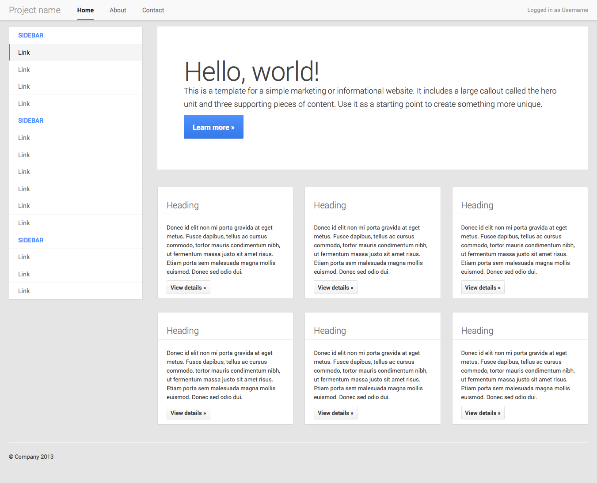

# Tugas 1 CSS Lanjutan

Buat `Layout` atau tata letak tampilan menggunakan HTML dan CSS sebagaimana gambar dibawah ini:

### Catatan
- Tugas yang sudah selesai langsung disetorkan ke mentor untuk dicek
- Tugas dikumpul maksimal sehari sebelum kelas dilaksanakan