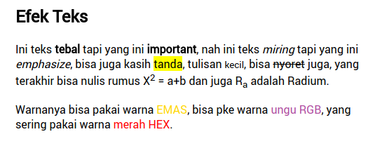

# Tugas 1 HTML Dasar

1. Buat halaman dengan judul _Tugas 1 - HTML_

2. Buat _Heading 1_ dengan konten kepanjangan dari **HTML**

4. Buat link berupa gambar logo google yang mengarah ke `google.com` di-tab baru

4. Buat sebagaimana gambar:

   

5. Buat _quote panjang_ berupa ayat al-quran dari `quran.com`

6. Buat teks komentar dengan konten `ini komentar tidak terlihat`

7. Tampilkan gambar dari `unsplash.com` dengan panjang 500px dan lebar 500px dengan alternatif teks `unsplash.com`

### Catatan
- Tugas yang sudah selesai langsung disetorkan ke mentor untuk dicek
- Tugas dikumpul maksimal sehari sebelum kelas dilaksanakan