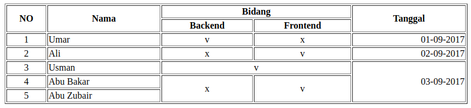
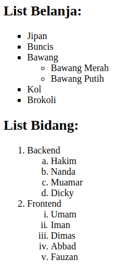
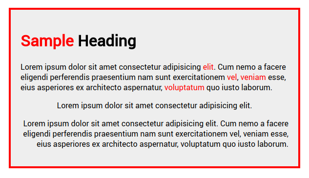

# Tugas 2 HTML Dasar

1. Buat sebagaimana gambar:

   

2. Buat sebagaimana gambar:

   

3. Buat sebagaimana gambar:

   

4. Embed peta dari google maps

5. Ubah background halaman menggunakan gambar pattern dari `free-patterns.info`

6. Ubah font halaman menjadi `Roboto` dari google web font

7. Semua _style css_ diatas ditaruh disatu file `style.css`

### Catatan
- Tugas yang sudah selesai langsung disetorkan ke mentor untuk dicek
- Tugas dikumpul maksimal sehari sebelum kelas dilaksanakan