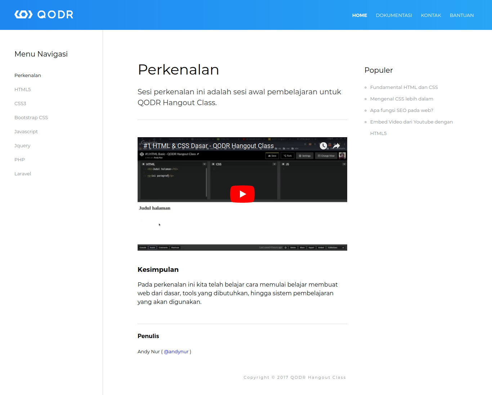

# Tugas 4 HTML Dasar

1. Buat file dengan nama `tugas-4.html`, lalu beri `title` Tugas 4 - HTML & CSS Dasar

2. Tambahkan `HTML5Shiv` pada tag `head` 

3. Buatlah tampilan tata letak atau layout menggunakan `HTML5 Semantic` sebagaimana gambar dibawah ini : 

    

    Asset yang diperlukan:
    - Font [Montserrat](https://fonts.google.com/specimen/Montserrat)
    - Logo [QODR](https://github.com/qodrorid/hangout_class/blob/master/HTML/tugas/assets/tugas_4/qodr-logo.png)

### Catatan 
- Tugas yang sudah selesai langsung disetorkan ke mentor untuk dicek
- Tugas dikumpul maksimal sehari sebelum kelas dilaksanakan